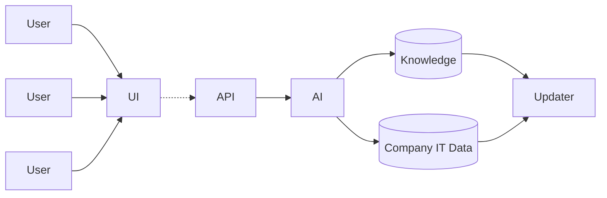

# Cloud_Calculator
- IT Sales / Management Tool
- Powered by AI
- Modular / Organized Design
---
## Designed Flow Chart:

---
## UI:
- React Dashboard
- Web / App Based
- Uses:
  - nginx
  - node

## API:
- AI API parses incoming data
- returns AI response
- Also handles doc. updates

## AI:
- Some LLM with data pipe lines

## Knowledge:
- IT Software Requirements
- IT Hardware Requirements
- Cloud Solution Requirements
- Uses:
  - Postgre / Mongo DB 

## Company IT Data
- Comapnies current IT Infrastructure information
- Used on management side
- Uses:
  - Postgre / Mongo DB

## Updater:
- Python based updater script to update `Knowledge` and `Company IT Data`
- Scheduled updates (scheduled by the manager)
- Uses:
  - Python 3.13
---
## Order of Completion
1. Initial Docker Compose File setup
   - Knowledge
   - Company IT Data
   - Updater
  
2. Updater
   - Data Aggregation for:
     - IT Software / Hardware
     - Cloud Solutions
   - Scheduled Updates

3. AI Setup
   - Model Selection
   - Data Pipeline setup

4. API / UI Setup / Design
   - Design and Implement the Frontend design
---
